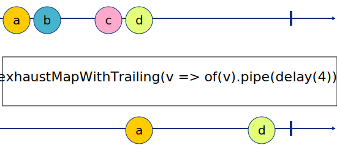

# rxjs-exhaustmap-with-trailing

A variant of [RxJS exhaustMap](https://rxjs.dev/api/operators/exhaustMap) that includes trailing emissions from the source observable.



Just like the [`exhaustMap()`](https://rxjs.dev/api/operators/exhaustMap) RxJS operator, `exhaustMapWithTrailing()` will ignore all emissions from source observable as long as the projected observable is pending, but in addition it will include the last emission received from the source observable before the projected observable completed. Think of it as a combination of [`exhaustMap()`](https://rxjs.dev/api/operators/exhaustMap) and [`debounce()`](https://rxjs.dev/api/operators/debounce).

## Usage

```js
import {exhaustMapWithTrailing} from "rxjs-exhaustmap-with-trailing"
import {delay} from "rxjs/operators"
import {fromEvent, of} from "rxjs"

const clicks = fromEvent(document, "click")

const result = clicks.pipe(
  exhaustMapWithTrailing((value) => of(value).pipe(delay(1000)))
)
result.subscribe((event) =>
  console.log("result: %d, %d", event.clientX, event.clientY)
)
```

[Open CodeSandbox](https://codesandbox.io/s/recursing-haibt-rd1l6?file=/index.js)

## API

### exhaustMapWithTrailing

```
exhaustMapWithTrailing<T, R>(project: (value: T, index: number) => ObservableInput<R>): OperatorFunction<T, R>;
```

### exhaustMapToWithTrailing

```
exhaustMapToWithTrailing<T, R>(innerObservable: Observable<R>): OperatorFunction<T, R>;
```

## Credits

This is a packaged and unit tested version of the implementation posted by @aaronjensen here: https://github.com/ReactiveX/rxjs/issues/5004
